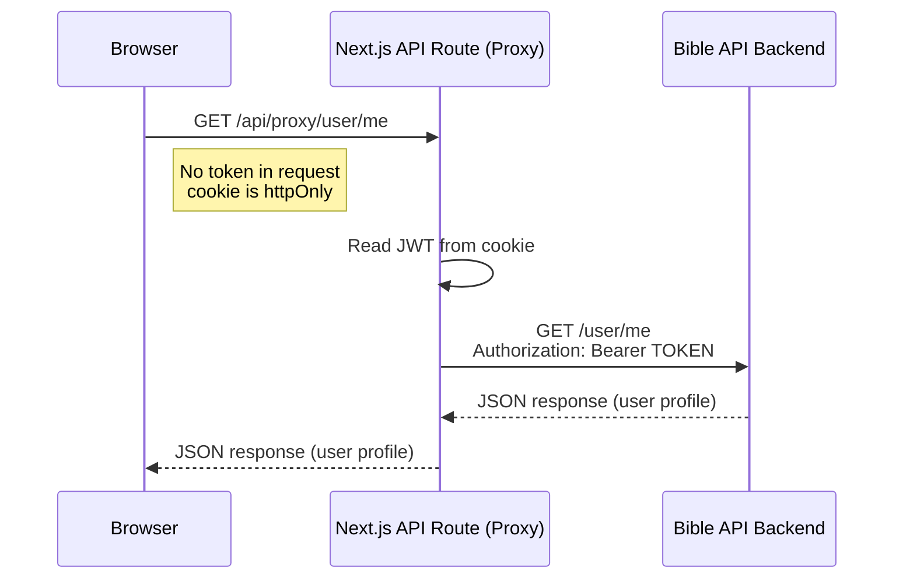

# EOTC Bible Frontend

This is the frontend for the EOTC Bible project, built with **Next.js (App Router, TypeScript)**. It communicates with the [Bible App Backend API](https://github.com/EOTCOpenSource/EOTCbibleBE/api/v1) securely using **JWT authentication** stored in **httpOnly cookies**.

---

## 📜 Overview

The backend API requires an **`Authorization: Bearer <token>`** header for all **protected routes** (e.g., `/user/me`, `/progress`, `/bookmarks`)  
Our frontend **never stores the JWT in localStorage or in client-side JS**.  
Instead, we use:

1. **Login/Register API routes in Next.js** to:
   - Send credentials to the backend.
   - Receive `{ token, user }` from the backend.
   - Store the token in a **httpOnly cookie** (not accessible by JS).
2. **Proxy API routes** in Next.js to:
   - Read the JWT from the httpOnly cookie on the server.
   - Attach `Authorization: Bearer <token>` when calling the backend.
   - Return the backend's response to the client.

This pattern improves **security**, **code maintainability**, and **CORS handling**.

---

## 🔒 Why This Approach?

### 1. Security

- **httpOnly cookie** means JS running in the browser **cannot** access the token (reduces XSS risk).
- The token **never** appears in `localStorage`, `sessionStorage`, or browser memory.

### 2. Centralized Token Handling

- All backend calls requiring a token are handled through `/api/proxy`.
- If the backend auth format changes, we update only the proxy logic.

### 3. No CORS Headaches

- The frontend talks only to its **own** domain (`/api/...`).
- The proxy handles cross-domain communication with the backend.

---

## 📂 Project Structure (Auth-Related)

```txt
app/
  api/
    auth/
      login/route.ts       # Calls backend /auth/login, sets httpOnly cookie
      register/route.ts    # Calls backend /auth/register, sets cookie
      logout/route.ts      # Clears auth cookie
    proxy/[...path]/route.ts  # Forwards requests to backend with Authorization header
lib/
  env.ts                   # Environment variable helpers
  cookies.ts               # Read JWT from httpOnly cookie
  server-fetch.ts          # Fetch backend from server components
  proxy-client.ts          # Fetch backend via proxy from client components
middleware.ts              # Protects routes from unauthenticated access
```

---

## 🔄 Request Flow



---

## 🚀 How to Authenticate

### Login

1. `POST /api/auth/login` with `{ email, password }`.
2. Next.js route forwards to backend `/auth/login`.
3. Backend returns `{ token, user }`.
4. Next.js route sets **`auth_token`** cookie (httpOnly, Secure).
5. Browser is redirected or fetch continues.

### Access Protected Route (Client)

```ts
import { clientApiFetch } from "@/lib/proxy-client";

// Example: Fetch reading progress
const data = await clientApiFetch("/progress");
```

### Access Protected Route (Server)

```ts
import { serverApiFetch } from "@/lib/server-fetch";

const me = await serverApiFetch("/user/me");
```

### Logout

```ts
await fetch("/api/v1/auth/logout", { method: "POST" });
```

This clears the cookie.

---

## 📌 Notes for Developers

- **Never** read or write JWTs in client-side JS.
- Always use the **proxy** or `serverApiFetch` helpers to contact the backend.
- Keep your `.env.local` with:
  ```bash
  BACKEND_BASE_URL=https://domain.com/api/v1
  JWT_COOKIE_NAME=auth_token
  NEXT_PUBLIC_APP_NAME="Bible App"
  ```
- Middleware will **redirect unauthenticated users** from protected routes to `/login`.

---

## 🎥 Recommended Learning

- [JWT Auth with Next.js and httpOnly Cookies (YouTube)](https://www.youtube.com/watch?v=T6fRWZWrJzI)

This video explains the core ideas behind storing JWTs in httpOnly cookies and using server routes as a proxy.

---

## ✅ Benefits Recap

| Feature               | Why It Matters                                   |
| --------------------- | ------------------------------------------------ |
| httpOnly cookies      | Token never exposed to JS (reduces XSS risk)     |
| Proxy-based fetching  | No CORS issues, centralized auth logic           |
| Server + Client usage | Same token works in server and client components |
| Easy to maintain      | Change auth logic once in proxy                  |
